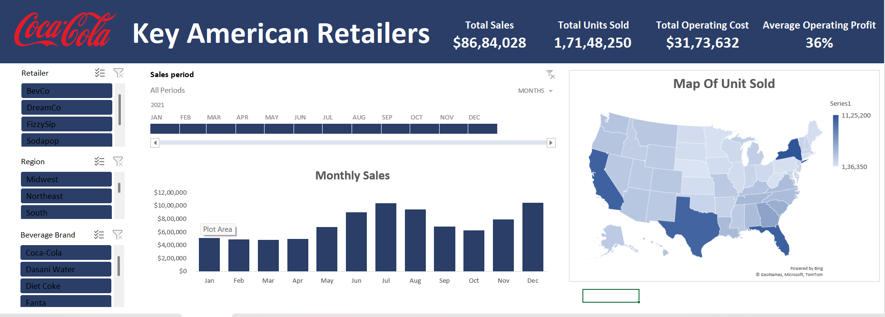

# 🥤 Coca-Cola US Retail Dashboard

A professional Excel dashboard to analyze Coca-Cola's sales performance across major American retailers. Built with clean visuals, interactive filters, and geo-mapping.

---

## 📸 Screenshot

---

## 🔍 Key Features

- 📊 Total Sales, Units Sold, Operating Cost & Profit % at a glance  
- 🗺️ U.S. map of unit sales by state  
- 📅 Monthly sales trends  
- 🔘 Filters by Retailer, Region, and Beverage Brand

---

## 🚀 Tools Used

- Microsoft Excel  
- Pivot Tables & Slicers  
- Dynamic Bar and Geo Maps  
- KPI Cards

